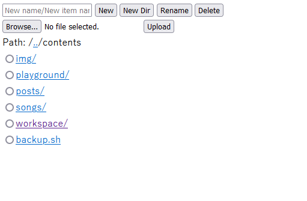
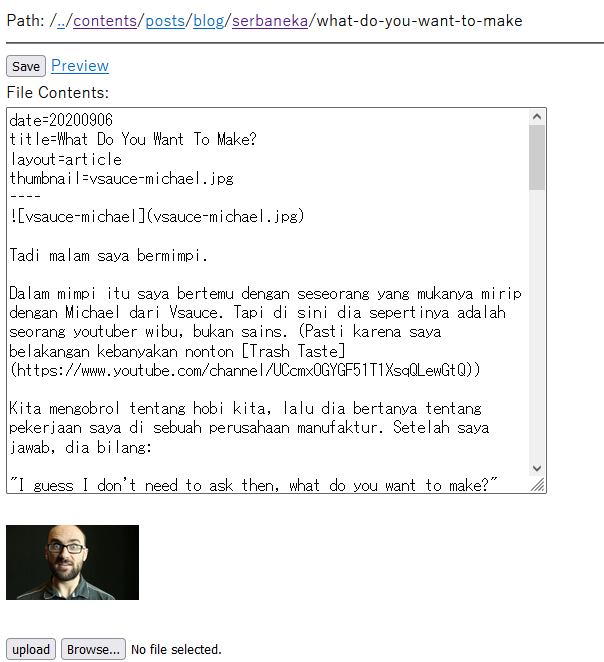

# wed
Simple note taking app with simple file management using PHP.

This was intended to be used as an editing tools for my blog. 
But in practice it is just a simple file management and text editing tool for general purpose, everyday note-taking.

It has autosave feature that saves when idle after a few seconds.

The text editing has an uploader that can automatically insert image as markdown entry. Convenient for writing posts.

# Screenshots

File management screen.

Text editing screen.

